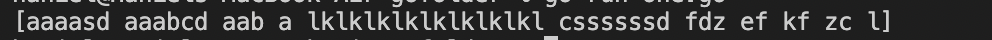
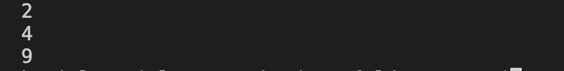
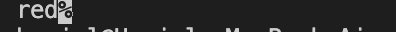
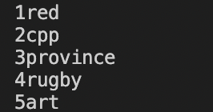

# Go Functions :

## Go files:

There are three different files with functions and one with tests for different cases.

<ol>
<li>Function to sort words with repeated characters</li>
<li>Recursive function that takes one integer parameter</li>
<li>Function that takes one parameter as an array or list</li>
</ol>

### Commands

The commands for running the programs are below.

#### one.go

Type: `go run one.go` and the program will run and sort the strings based on the conditions

Result:   

#### two.go

Type: `go run two.go` and the program will run recursively

Result:   

#### three.go

Type: `go run three.go` and the program will run and pick the data from the array

Result:   

#### testing

Type: `go test` and the program will run and carry out the tests

Result:   

